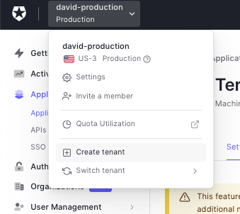
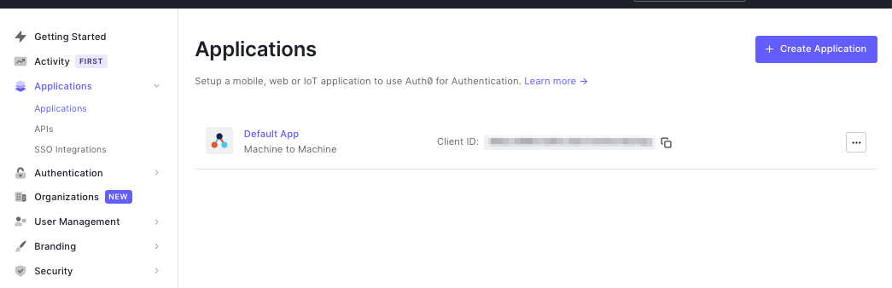
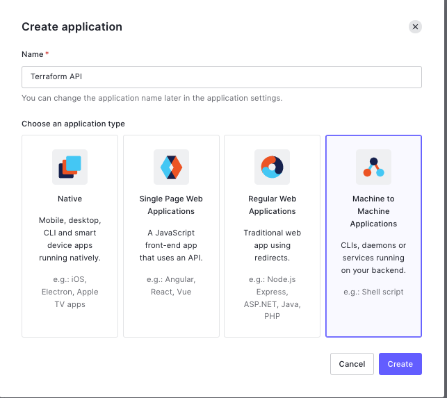
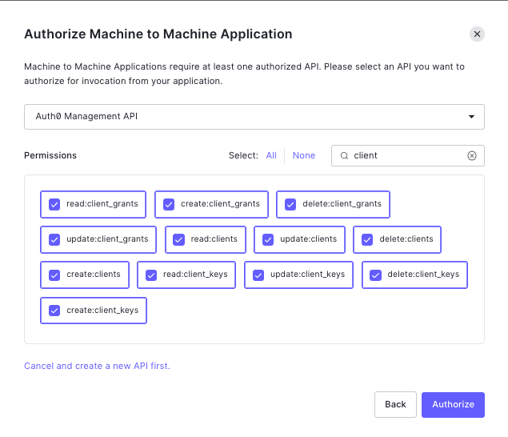
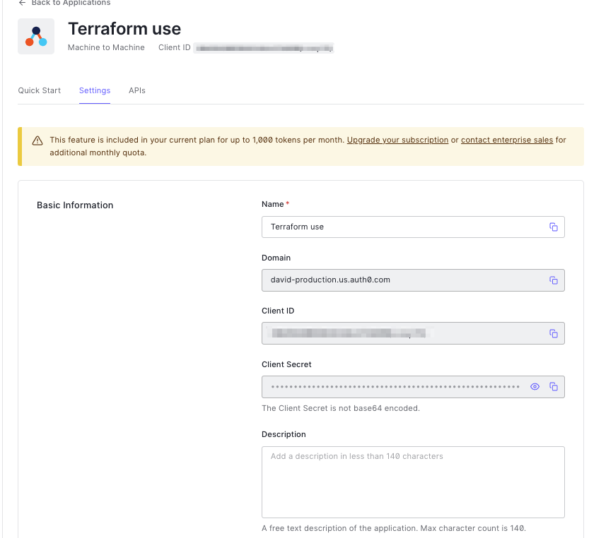

## Setting up an Auth0 tenant
You can create a tenant from the Auth0 Web UI, it's recommended to separate your production and staging environments tenants.

## Setting up an Auth0 API
1. To use Auth0 for Serverless, we use terraform to generate an OIDC compatible client, you will need an API client that terraform can interact with, start by Creating a *Machine to Machine application*.

2. Pick the default Management API and grant it all the `client` and `client_keys` permissions.

3. Now you should have a set of credentials able to manage Auth0 Clients through Terraform.

